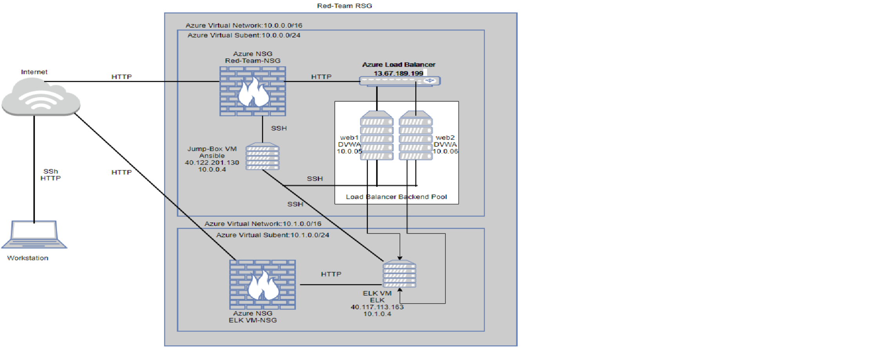

# Automated ELK Stack Deployment

The files in this repository were used to configure the network depicted below.

These files have been tested and used to generate a live ELK deployment on Azure. They can be used to either recreate the entire deployment pictured above. Alternatively, select portions of the ansible playbooks file may be used to install only certain pieces of it, such as Filebeat.

This document contains the following details:
- Description of the Topologu
- Access Policies
- ELK Configuration
  - Beats in Use
  - Machines Being Monitored
- How to Use the Ansible Build

### Description of the Topology

The main purpose of this network is to expose a load-balanced and monitored instance of DVWA, the D*mn Vulnerable Web Application.

Load balancing ensures that the application will be highly realiable, in addition to restricting traffic to the network.
The importance of Loadbalancer is to 

**Protect applications from emerging threats**
The Web Application Firewall (WAF) in the load balancer protects your website from hackers and includes daily rule updates just like a virus scanner

**Authenticate User Access**
The load balancer can request a username and password before granting access to your website to protect against unauthorized access

**Protect against DDoS attack**
The load balancer can detect and drop distributed denial-of-service (DDoS) traffic before it gets to your website

- What is the advantage of a jump box?

**An SSH jump server** is a regular Linux server, accessible from the Internet, which is used as a gateway to access other Linux machines on a private network using the SSH protocol. **The purpose of an SSH jump server** is to be the only gateway for access to your infrastructure reducing the size of any potential attack surface. Having a dedicated SSH access point also makes it easier to have an aggregated audit log of all SSH connections.

Integrating an ELK server allows users to easily monitor the vulnerable VMs for changes to the **filesystem** and **system logs**.

- What does Filebeat watch for?

Filebeat is a lightweight shipper for forwarding and centralizing log data. Installed as an agent on your servers, Filebeat monitors the log files or locations that you specify, collects log events, and forwards them either to Elasticsearch or Logstash for indexing.

- What does Metricbeat record?

Metricbeat is a lightweight shipper that you can install on your servers to periodically collect metrics from the operating system and from services running on the server. Metricbeat takes the metrics and statistics that it collects and ships them to the output that you specify, such as Elasticsearch or Logstash.
Metricbeat helps you monitor your servers by collecting metrics from the system and services running on the server such as Apache, Nginx, MongoDB etc.

The configuration details of each machine may be found below.

| Name    | Function   | IP Address     | Operating System        |
|---------|------------|----------------|-------------------------|
|JumpBox-VM | Gateway    | 40.122.201.130 | Ubuntu Server 20.04 LTS |
| Web1    | Web Server | 10.0.0.5       | Ubuntu Server 20.04 LTS |
| Web2    | Web Server | 10.0.0.6       | Ubuntu Server 20.04 LTS |
| Elk VM  | Elk Stack  | 40.117.113.163 | Ubuntu Server 20.04 LTS |

### Access Policies

The machines on the internal network are not exposed to the public Internet. 
Only the Jump Host machine can accept connections from the Internet. Access to this machine is only allowed from the following IP addresses:
- 142.116.144.48/32

Machines within the network can only be accessed by **Jump Box**

A summary of the access policies in place can be found in the table below.

| Name         | Publicly Accessible | Allowed IP Addresses |
|--------------|---------------------|----------------------|
| Jump-Host VM | Yes                 | 142.116.144.48/32    |
| Web1         | No                  |              -        |
| Web2         | No                  |      -                |
| ELK VM       | Yes                 | 142.116.144.48/32    |

### Elk Configuration

Ansible was used to automate configuration of the ELK machine. No configuration was performed manually, which is advantageous because...

**Simplified Automation**
Ansible is a simple-to-use platform, easy to install and configure, with a very fast learning rate. In less than 30 minutes, it’s possible to install and configure the system and execute ad hoc commands for servers to solve a specific problem: daylight saving time adjustments, time synchronization, root password change, updating servers, restarting services, and so on. 

**Low Learning Curve**
Ansible is easy to deploy because it uses no agents or additional custom security infrastructure. It also leverages YAML, a simple language to describe your automation job via playbooks. Playbooks push the desired settings on the hosts defined in the inventory and can even be run ad hoc (via the command line, not requiring definitions in files). 

**Automate Now**
From the moment you can ping the hosts through Ansible, you can start automating your environment. Begin with small tasks, following best practices, prioritizing tasks that add value to the business, solve major problems, and gain time and improving productivity.

The playbook implements the following tasks:
•	Configure Elk VM by installing Docker engine (docker.io)
•	Using the apt module, we Install python3-pip
•	Further using pip, we Install docker
•	Elasticsearch uses a mmapfs directory by default to store its indices. The default operating system limits on mmap counts is likely to be too low, which may result in out of memory exceptions. To set this value permanently, update the vm.max_map_count  to 262144
•	Further we download and launch a docker elk container using the image sebp/elk:761
•	Enable service docker on boot

The following screenshot displays the result of running `docker ps` after successfully configuring the ELK instance.

### Target Machines & Beats
This ELK server is configured to monitor the following machines:
Web1: 10.0.0.5/32
Web2: 10.0.0.6/32

We have installed the following Beats on these machines:
**File Beat**
**Metric Beat**

These Beats allow us to collect the following information from each machine:
The Filebeat Elasticsearch module can handle audit logs, deprecation logs, gc logs, server logs, and slow logs etc
Audit logs - Having detailed audit logs helps companies monitor data and keep track of potential security breaches or internal misuses of information. 
GC logs - helps in identifying how long the process lasted, how many objects were promoted, how much memory was reclaimed, and other useful information.
slow logs - The slow query log can be used to find queries that take a long time to execute and are therefore candidates for optimization.
Metricbeat collect metrics from the operating system and from services running on the server.

### Using the Playbook
In order to use the playbook, you will need to have an Ansible control node already configured. Assuming you have such a control node provisioned: 

SSH into the control node and follow the steps below:
- Copy the filebeat-config.yml file to /etc/ansible/roles.
- Update the filebeat-config.yml file to include the ELK private IP (10.1.0.4) in line 1106 under "elasticsearch output" and line 1806 under the "Kibana Output Configuration" section.
- Run the playbook, and navigate to http://40.117.113.163:5601/app/kibana to check that the installation worked as expected.

_TODO: Answer the following questions to fill in the blanks:_
- _Which file is the playbook? filebeat-playbook.yml
-_Where do you copy it? /etc/ansible/roles
- _Which file do you update to make Ansible run the playbook on a specific machine? hosts file
 How do I specify which machine to install the ELK server on versus which to install Filebeat on?
 In the hosts file, you would go under "# Ex 2: A collection of hosts belonging to the 'webservers' group and have two sections, one for webservers and the other for your elk server.
- Which URL do you navigate to in order to check that the ELK server is running?
http://40.117.113.163:5601/app/kibana

_As a **Bonus**, provide the specific commands the user will need to run to download the playbook, update the files, etc._